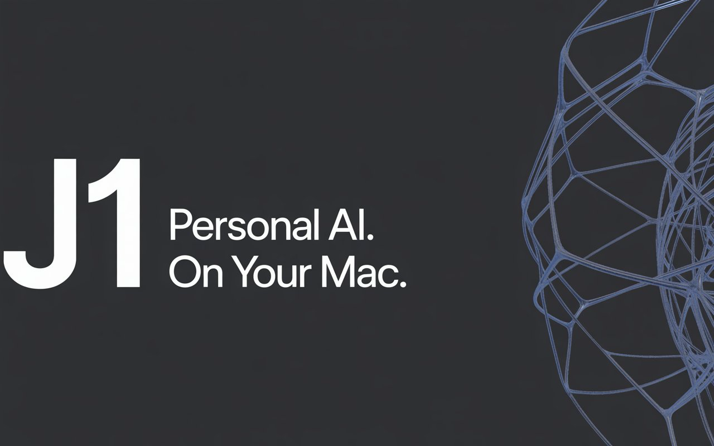

# J1

A local AI assistant for Mac.

## Requirements

- macOS 14 Ventura or later
- Apple Silicon (M1 or later): download `J1-arm64.dmg`
- Intel Mac: download `J1.dmg`

## Installation

### 1. Install Ollama

Download and install [Ollama](https://ollama.com) — J1 uses it as the local AI backend.

### 2. Install J1

Download the DMG from [Releases](https://github.com/maxwindrich770-boop/J1/releases), open it, and drag J1 to your Applications folder.

> **First launch blocked?** Right-click J1 in Applications → Open → Open anyway. This is a one-time step for unsigned apps.

### 3. Get your API keys

J1 works without any keys (falls back to local Ollama), but cloud keys make it significantly faster and smarter.

| Service | Free tier | Where to get it |
|---------|-----------|-----------------|
| **Groq** (recommended) | ~500 tokens/sec, generous free tier | [console.groq.com](https://console.groq.com) → API Keys → Create Key |
| **Gemini** (optional fallback) | Free, no credit card | [aistudio.google.com/api-keys](https://aistudio.google.com/api-keys) → Create API Key |
| **Tavily** (web search) | 1,000 searches/month free | [tavily.com](https://tavily.com) → Dashboard → API Keys |

**iCloud Mail & Calendar (optional)**
J1 can read your unread iCloud emails and upcoming calendar events.
Use an [App-Specific Password](https://appleid.apple.com) — never your Apple ID password.
Go to appleid.apple.com → Security → App-Specific Passwords → click "+" → name it "J1".

### 4. Configure

On first launch, J1 walks you through the setup. You can also edit the config file directly at `~/.j1/.env`.

## Upcoming

### 1. Settings & Setup Wizard
All configuration options accessible through the app — no manual `.env` editing required. Setup wizard on first launch and a settings screen will cover model selection, language & voice, API keys, iCloud, Obsidian vault, and more.

### 2. Google Integration
Support for Google Calendar, Gmail, Google Drive, Google Tasks, and Google Contacts — the same features currently available for iCloud users.

### 3. Windows Support
Native Windows compatibility. Main blocker is the macOS-only `afplay` audio player.

## Credits

See [CREDITS.md](CREDITS.md).
